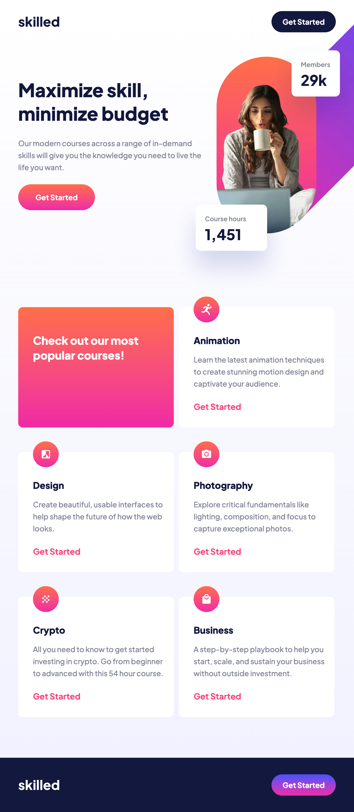

# Skilled e-Learning Landing Page

This is my solution to the [Skilled e-learning landing page challenge on Frontend Mentor](https://www.frontendmentor.io/challenges/skilled-elearning-landing-page-S1ObDrZ8q). The goal of this challenge was to build a fully responsive landing page based on a provided design. I used modern HTML and CSS practices with a mobile-first approach.

## 🚀 Live Demo

- 🔗 Live Site: [View the site](https://ahmednasser111.github.io/skilled-elearning-landing-page)
- 💻 Source Code: [GitHub Repository](https://github.com/ahmednasser111/skilled-elearning-landing-page)

## 📱 Screenshots

| Mobile | Tablet | Desktop |
|-------|--------|---------|
|  |  |  |

## 🧠 Features

- Fully responsive layout (mobile, tablet, desktop)
- Accessible HTML structure
- Responsive images using `<picture>` and `<source>`
- Interactive hover effects

## 🛠️ Built With

- Semantic HTML5
- CSS custom properties
- Flexbox
- Mobile-first workflow

## 💡 What I Learned

Through this challenge, I deepened my understanding of:

- Responsive image handling with the `<picture>` tag
- Layout adjustments for different screen sizes
- Writing clean, maintainable HTML and CSS

## 📚 Useful Resources

- [Responsive Images - MDN Docs](https://developer.mozilla.org/en-US/docs/Learn/HTML/Multimedia_and_embedding/Responsive_images)
- [CSS Tricks - Guide to Responsive Images](https://css-tricks.com/a-guide-to-the-responsive-images-syntax-in-html/)
- [Josh W Comeau - Pixel Perfection Article](https://www.joshwcomeau.com/css/pixel-perfection/)

## 👨‍💻 Author

- **Ahmed Nasser**
- Frontend Mentor: [@ahmednasser111](https://www.frontendmentor.io/profile/ahmednasser111)
- GitHub: [@ahmednasser111](https://github.com/ahmednasser111)

## 🙏 Acknowledgments

Thanks to the amazing Frontend Mentor community. This challenge helped me enhance my frontend skills and confidence in building real-world layouts.